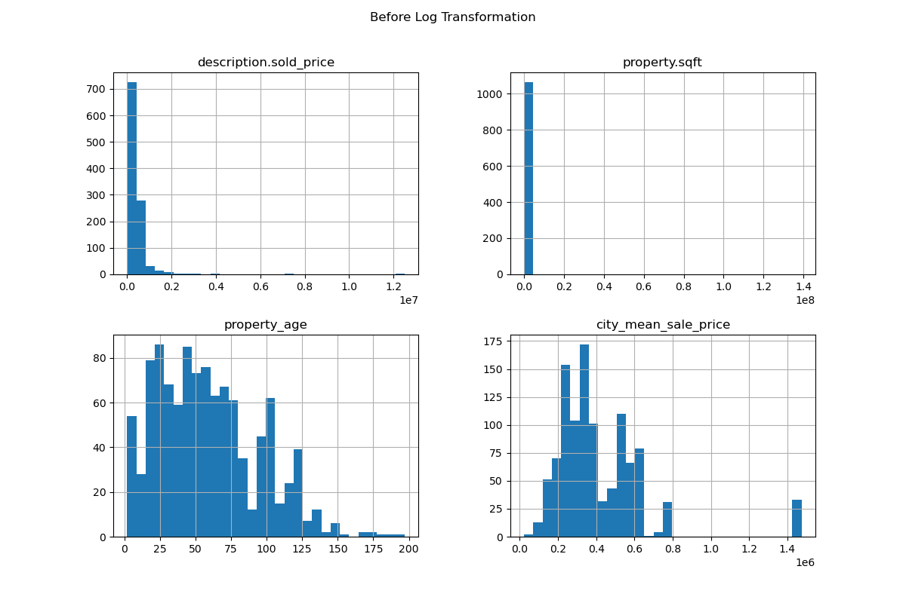
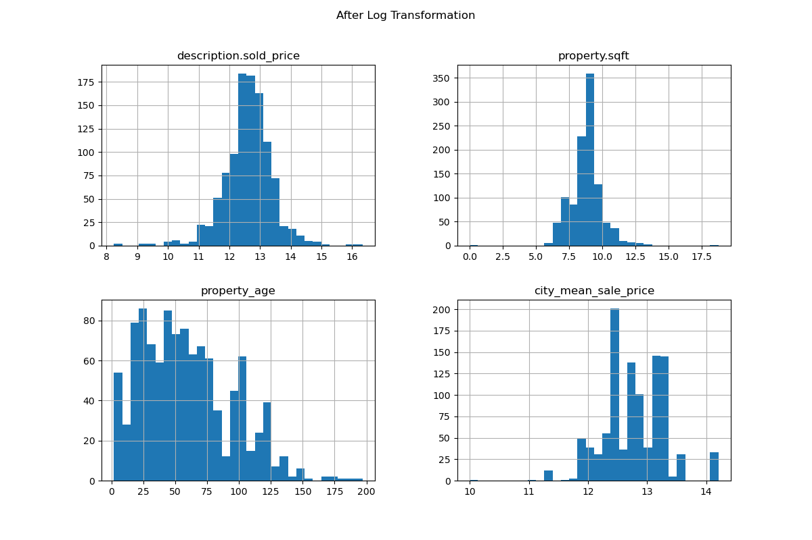
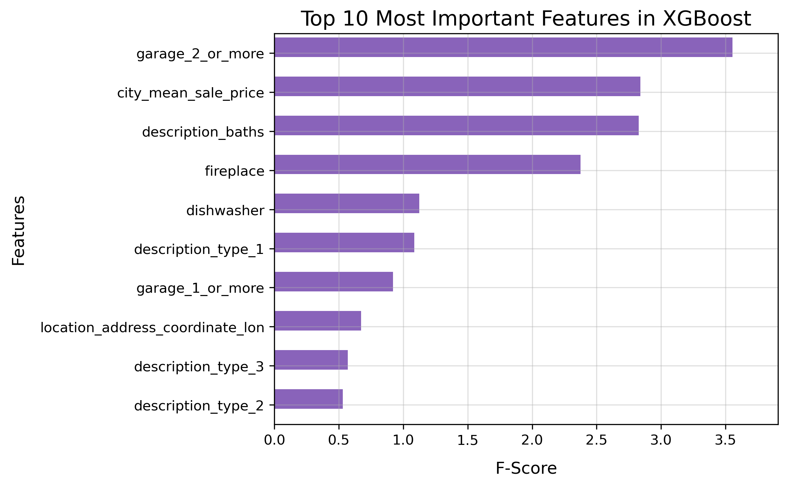
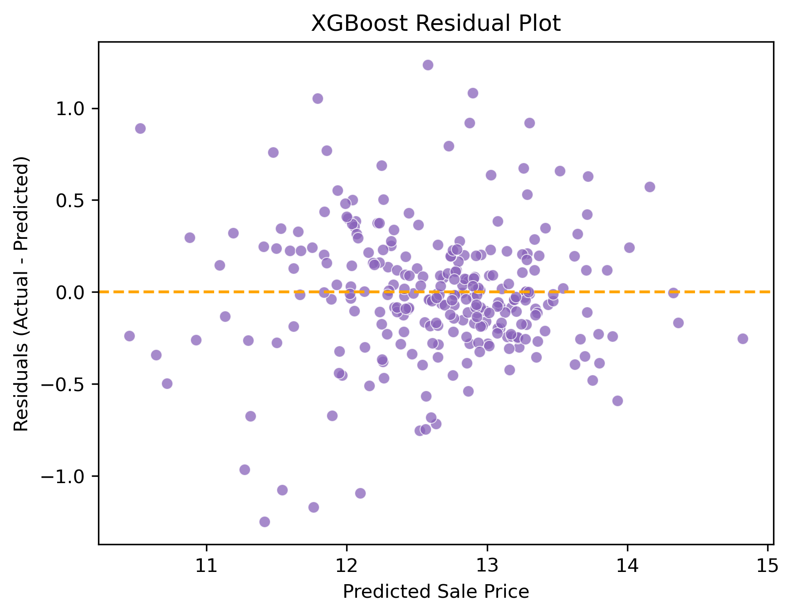
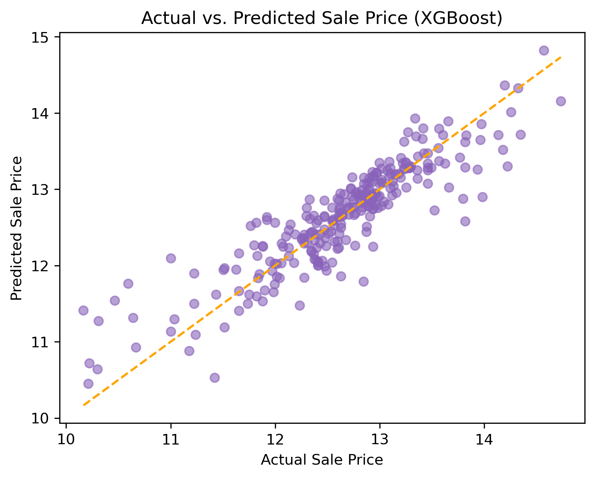

# Data Science Midterm Project

## Project/Goals
This project aims to predict U.S. housing prices using real estate transaction data. By cleaning and analyzing raw data, we develop machine learning models to estimate home values based on key features like location, size, and market trends.

Goals:
- Load, preprocess, and explore housing sales data.
- Train, evaluate, and optimize supervised learning models.
- Fine-tune the best model and implement a prediction pipeline.

Following a structured approach, this project applies best practices in data science to build a housing price prediction model.

## Process

### [Data Cleaning, Exploration and Visualization](./notebooks/1%20-%20EDA.ipynb)
#### Data Importing
1. Wrote the following functions to automate the import process.
  - `json_files_summary(path)` : Takes a directory path and stores file details.
  - `read_json(file_path)` : Takes a specific file path, reads all the JSON files and returns its contents as a DataFrame.
2. Excluded files with no data in them.

#### Data Cleaning and Wrangling
1. Wrote `cols_overview(df)` function which takes a DataFrame as and returns another sorted DataFrame (according to nulls_count) with details of concern such as the number of null_values, the unique values, column name, it's first 5 values, last 5 values, and dtype of the column.
2. Reviewed, replaced and imputed null values as necessary.
3. Dropped columns that are completely empty.
4. Dropped redundant columns.

#### Dealing with Tags
1. `'tags'` column is an object of `'str'` dtype and needed converted into a `'list'` type for `.explode()` to work.
2. Modified  `'encode_tags(df, min_frequency)'` function to manually encode tags from each sale. This function utilized sklearn's `MultiLabelBinarizer` to perform One-Hot Encoding on tags.
3. Wrote function `'calculate_min_frequency(data, column_name)'` to calculate the minimum frequency threshold for filtering low-frequency categorical values (tags)

#### Dealing with Cities
1. Split the data and used the training data to encode `'city'` with mean sale price.
2. Used binary encoder on property `'description.type'` column (only 9 unique values), so we can keep the categorical components without having to add more columns.

#### EDA/Visualization
1. Analyzed numerical variable distributions.

  

2. Checked for skewness and applied log transformation for highly skewed columns.

  

3. Checked for potentially redundant features and found none.

4. Used Standard Scaler on select columns with high variance.

### 2 - [Model Selection](./notebooks/2%20-%20model_selection.ipynb)
We tried a few models:
| Model              | Train MAE | Test MAE | Train RMSE | Test RMSE | Train R^2 | Test R^2 |
|--------------------|----------|----------|------------|-----------|----------|---------|
| **Linear Regression** | 0.30     | 0.30     | 0.43       | 0.39      | 0.6905   | 0.7447  |
| **SVR**           | 0.15     | 0.26     | 0.31       | 0.37      | 0.8466   | 0.7683  |
| **Random Forest**  | 0.21     | 0.28     | 0.33       | 0.40      | 0.8169   | 0.7293  |
| **XGBoost**       | 0.20     | 0.27     | 0.30       | 0.37      | 0.8494   | 0.7758  |

 

1. **Linear Regression, RidgeCV, LassoCV, ElasticNetCV**
    > The LR model performed reasonably well with R^2 = 0.69 on training data and R^2 = 0.74. This means it explains about 69-74% of the variance in the sale price.
    
    > The LR model's test performance is also slightly better than train, meaning no overfitting happened and the model is able to generalize well to new data.

    > With RidgeCV, LassoCV, ElasticNetCV, the main thing of note is that these models did not perform any better or worse than regular Linear Regression. Linear models just aren't the answer for this dataset.

2. **Support Vector Machine (SVM) for Regression**
    > The SVR model's Train MAE (0.15) and Test MAE (0.26) is lower than the previous models meaning it makes better predictions. The RMSE (0.31 on Train and 0.37 on Test) supports this.

    > The SVR Model did good, but it had a slightly larger gap between Train (0.8494) and Test R^2 (0.7758), meaning it doesn't generalize as well to new data.

3. **Random Forest**
    > RF's Test R² (0.7293) is lower than SVR's 0.7683, meaning SVR captured variance better. Random Forest also has a higher RMSE and MAE, meaning slightly worse predictions.

    > What RF excelled in is less overfitting with the Train R²: 0.8169 vs Test R²: 0.7293 indicates a Smaller gap than SVR, suggesting RF generalizes slightly better than SVR.

4. **XGBoost**
    > The XGBoost Model (R^2 = 0.7758 on test) performed slightly better than SVR (R^2 = 0.7683) and RF (R^2 = 0.7293)

    > **XGBoost performed the best overall** with the highest Test R² (0.7758) and balanced Train/Test error. This is the model we are finetuning.

 

## Results
| Metric             | Before (XGBoost) | After (Fine-Tuning) | Change |
|--------------------|-----------------|--------------------|--------|
| **Test MAE**      | 0.2700           | **0.2536**         | **-6.1%** |
| **Test RMSE**     | 0.3700           | **0.3525**         | **-4.7%** |
| **Test R² Score** | 0.7758           | **0.7945**         | **+2.4%** |

### Finetuned XGBoost Performance:
- Lower MAE (0.2536) :: Predictions are now, on average, **closer to the actual price** 

- Lower RMSE (0.3525) :: The model makes **fewer large errors**, leading to **more stable predictions**

- Higher R^2 Score (0.7945) :: The model now explains **79.45% of the variance in house prices**, up from **77.58%**, meaning it captures more predictive patterns.

 

### Feature Importance
The most influential features are garage_2_or_more, city_mean_sale_price, description_baths, and fireplace.

The feature importance distribution suggests that a few variables have high importance while others contribute less, which is common in housing models.

> *The model is heavily relying on garage availability, city sale prices, and bathrooms, which makes sense for real estate valuation. However, some features may have low importance and could potentially be removed to simplify the model.*

  

 

### XGBoost Residual Plot
Residuals (actual - predicted) are mostly centered around 0, which is good.

There is some spread at higher predicted values, meaning the model struggles slightly with very high-priced properties.

> *The model is well-calibrated overall, with some minor over/underprediction at the extremes.
No obvious signs of bias, but it may underestimate high-priced properties slightly.*

  

 

### Actual vs. Predicted plot
Most points are closely following the diagonal line, indicating strong correlation between actual and predicted values.

There is some deviation for very high values, but it is not extreme.

A well-fitted model should have points tightly clustered around the line, and this one does a decent job.

> *The model has strong predictive power with some variance at higher price points.
There may be room for improvement in high-value property predictions, potentially by fine-tuning hyperparameters or adding interaction features.*

  

 

### In Conclusion
The model captures most patterns correctly, there's no major bias visible in residuals, and predictions align well with actual values.

High-priced properties show more spread. Some low-importance features could also be removed to simplify the model

 

## Challenges 
1. Iterative Data Cleaning & Wrangling
    > As we progressed, we kept identifying additional columns to drop that provided redundant or non-informative data.
    > Features such as overlapping location info and correlated variables had to be carefully analyzed before removal.
    > This step took longer than expected because it required multiple rounds of checking to ensure we weren't losing important data.

2. Handling List-Type Tags in String Format
    > One of the early challenges we encountered was dealing with tags stored as strings instead of lists.
    > This caused issues in processing and required us to convert them into actual lists before further analysis.

 

## Future Goals
1. More Advanced Feature Selection
    > Conduct a deeper analysis of feature importance using techniques like SHAP values to understand what truly drives house prices.

    > Use Recursive Feature Elimination (RFE) or Lasso regression to eliminate weak predictors.

2. Train Separate Models for High vs. Low-Priced Homes
    > Our residual plots suggest the model struggles with higher-priced homes.

    > A potential solution is to classify properties into high vs. low price ranges and train separate models for each to improve accuracy.

3. Address Potential Multicollinearity
    > Some features may still be too correlated, which can reduce model stability.
    
    > Perform Variance Inflation Factor (VIF) analysis to detect and remove collinear variables.

4. Incorporate More Location-Based Features
    > Our feature importance analysis showed that latitude/longitude weren’t highly relevant.

    > We could explore zip code clustering, using external datasets (e.g., average income, school ratings, crime rates) to enrich location-based predictions.